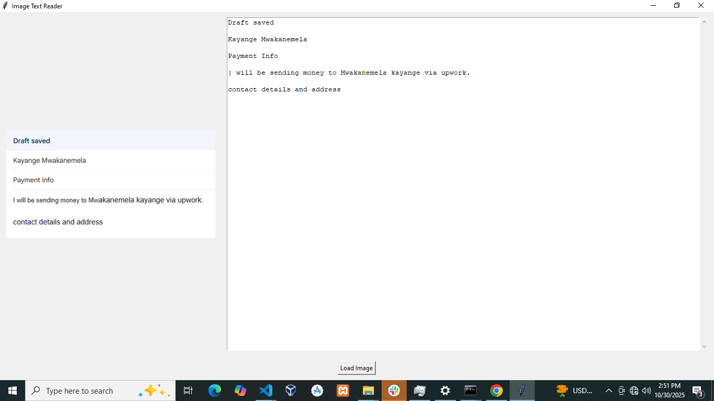

# About Image to text
=> Developed in python with pytesseract
=> The app reads text on an image and displays them in a text area where you can copy and paste, edit and many more...

## Example Output
